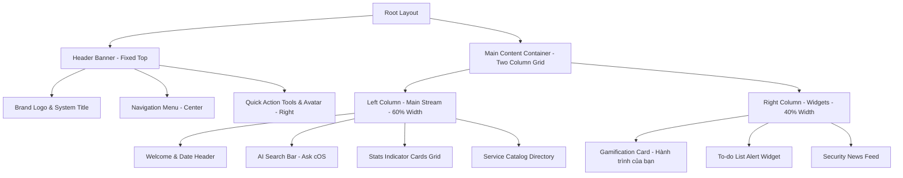

# Masan Group ISO cOS - Design System Specification

---

## 1. Hệ thống Màu sắc (Color Palette)

ISO cOS sử dụng bảng màu hiện đại, tối giản và chuyên nghiệp với tông màu chủ đạo là xanh Navy của Masan kết hợp các dải màu trung tính sáng và các màu cảnh báo/gamification trực quan.

### 1.1. Màu thương hiệu & Chủ đạo (Brand & Primary Colors)
*   **Masan Navy (Primary)**: `#004F9F` (hoặc tương đương trong hệ CSS: `text-primary`, `bg-primary`)
    *   *Sử dụng*: Màu sắc của logo Masan Group, các liên kết quan trọng, nút hành động chính (Primary Button), trạng thái active của menu ứng dụng.
*   **Masan Soft Navy (Secondary/Accent)**: `#0B3A70` hoặc `#1E3A8A`
    *   *Sử dụng*: Tiêu đề lớn (headings), các khu vực điều hướng quan trọng.
*   **Teal / Mint (Accent/Success)**: `#0D9488` hoặc `#10B981`
    *   *Sử dụng*: Trạng thái hoàn thành ("FULFILLED"), huy hiệu thi đua, các chỉ số tích cực.

### 1.2. Màu trung tính & Nền (Neutral & Background Colors)
*   **Page Background**: `#F8FAFC` (Slate 50) hoặc `#F1F5F9` (Slate 100)
    *   *Sử dụng*: Nền toàn trang, mang lại cảm giác sạch sẽ, giảm mỏi mắt cho nhân viên khi làm việc lâu.
*   **Card Background**: `#FFFFFF` (White)
    *   *Sử dụng*: Nền cho toàn bộ các khối nội dung (Cards), danh mục dịch vụ, ô tìm kiếm để tạo độ nổi bật trên nền xám nhạt.
*   **Border Color**: `#E2E8F0` (Slate 200) hoặc `#F3F4F6` (Gray 100)
    *   *Sử dụng*: Đường viền phân cách mỏng nhẹ giữa các phần, viền các ô nhập liệu và bảng biểu.

### 1.3. Màu văn bản (Typography Colors)
*   **Heading Text**: `#0F172A` (Slate 900)
    *   *Sử dụng*: Các tiêu đề chính như "Good afternoon, Nam", tên các nhóm ứng dụng lớn.
*   **Body Text / Secondary**: `#334155` (Slate 700) hoặc `#4B5563` (Gray 600)
    *   *Sử dụng*: Nội dung mô tả, văn bản thông thường.
*   **Muted Text / Placeholders**: `#64748B` (Slate 500) hoặc `#9CA3AF` (Gray 400)
    *   *Sử dụng*: Các đoạn ghi chú nhỏ, chữ hiển thị mặc định trong ô tìm kiếm ("Search…", "Ask cOS anything…").

### 1.4. Màu chỉ thị & Cảnh báo (Alert & Status Colors)
*   **Danger / Alert Red**: `#EF4444` (Red 500) hoặc `#DC2626` (Red 600)
    *   *Sử dụng*: Các cảnh báo an ninh ("FortiBleed"), trạng thái trễ hạn hoặc rủi ro ("SLA AT RISK").
*   **Warning Orange**: `#F97316` (Orange 500) hoặc `#F59E0B` (Amber 500)
    *   *Sử dụng*: Các thông tin về điểm kinh nghiệm (XP), cấp độ của nhân viên ("Cấp 1 - Người mới"), chuỗi ngày đăng nhập.

---

## 2. Hệ thống Phông chữ (Typography)

Typography của ISO cOS sử dụng hai phông chữ chính được cấu hình tối ưu cho cả hiển thị văn bản thường lẫn các thông số kỹ thuật.

### 2.1. Phông chữ chính (Primary Font)
*   **Font Family**: `Hanken Grotesk, system-ui, -apple-system, Segoe UI, Roboto, sans-serif`
*   **Đặc điểm**: Phông chữ không chân (Sans-Serif) mang tính hình học hiện đại, các nét bo tròn nhẹ tạo cảm giác cởi mở, thân thiện nhưng vẫn giữ được độ nghiêm túc của một hệ thống quản trị doanh nghiệp.
*   **Sử dụng**: Hơn 95% nội dung hiển thị bao gồm tiêu đề, thanh điều hướng, các nhãn nút và nội dung thẻ.

### 2.2. Phông chữ kỹ thuật (Monospace Font)
*   **Font Family**: `IBM Plex Mono, ui-monospace, SFMono-Regular, monospace`
*   **Đặc điểm**: Phông chữ đơn cách (Monospace) rõ ràng, sắc nét.
*   **Sử dụng**: Hiển thị ngày tháng (ví dụ: "TUESDAY, 30 JUNE 2026"), các con số thống kê chỉ số (0, 12/100 XP), mã số yêu cầu hoặc các dòng mã kỹ thuật.

### 2.3. Cấu hình Kích cỡ & Trọng lượng chữ (Size & Weight Matrix)

| Tailwind Class | Font Size (px) | Line Height (px) | Font Weight (CSS) | Vai trò trong giao diện |
| :--- | :--- | :--- | :--- | :--- |
| `text-2xl` / `text-3xl` | 24px - 30px | 32px - 38px | Bold (700) / Semibold (600) | Tiêu đề chính chào mừng người dùng |
| `text-lg` / `text-xl` | 18px - 20px | 28px | Semibold (600) | Tiêu đề các thẻ (Cards), nhóm ứng dụng |
| `text-base` | 16px | 24px | Medium (500) / Regular (400) | Văn bản trong thanh tìm kiếm lớn, nút bấm chính |
| `text-sm` | 14px | 20px | Regular (400) / Medium (500) | Nội dung mô tả danh mục, liên kết menu, text phụ |
| `text-xs` | 12px | 16px | Medium (500) | Ngày tháng, nhãn trạng thái ("SOON", "Mới") |

---

## 3. Quy chuẩn Khoảng cách & Bo góc (Spacing, Borders & Shadows)

Nhờ áp dụng Tailwind CSS, hệ thống tuân thủ nghiêm ngặt các tỷ lệ khoảng cách chuẩn 4px (chỉ số nhân của 4).

### 3.1. Khoảng cách (Spacing)
*   **Padding trong thẻ (Card Padding)**: `p-6` (24px) hoặc `p-4` (16px) tạo không gian thở (white space) tốt cho nội dung bên trong.
*   **Khoảng cách giữa các phần tử (Gaps/Margins)**:
    *   `gap-4` (16px) cho lưới danh sách dịch vụ nhỏ.
    *   `gap-6` (24px) cho khoảng cách giữa các thẻ chỉ số chính và các phân vùng layout.
    *   `space-y-4` / `space-y-6` để tạo khoảng giãn cách theo chiều dọc.
*   **Padding của trang**: `px-4 md:px-8 lg:px-12` đảm bảo hiển thị co giãn linh hoạt trên các thiết bị.

### 3.2. Bo góc (Border Radius)
*   **Giao diện hiện đại sử dụng bo góc lớn**:
    *   Các thẻ Card, Ô tìm kiếm lớn: `rounded-2xl` (16px) hoặc `rounded-xl` (12px).
    *   Nút bấm, nhãn nhỏ: `rounded-lg` (8px) hoặc `rounded-full` (bo tròn hoàn toàn cho các nút chức năng nhỏ).

### 3.3. Đổ bóng (Box Shadows)
*   Hệ thống sử dụng đổ bóng mờ, nhẹ nhàng để tạo chiều sâu (Z-axis):
    *   `shadow-sm` cho các thẻ tĩnh.
    *   `shadow-md` cho thanh tìm kiếm AI nổi bật và các menu dropdown khi active.
    *   Hiệu ứng chuyển đổi mượt mà (`transition-all duration-200`) khi rê chuột (hover) vào thẻ dịch vụ, làm thẻ nổi lên nhẹ nhờ tăng mức độ shadow.

---

## 4. Cấu trúc Layout & Kiến trúc Lưới (Grid Architecture)

ISO cOS sở hữu một bố cục hai cột linh hoạt kết hợp với hệ thống ngăn kéo ứng dụng (Application Drawer) đa dạng.

### 4.1. Header Banner Layout
*   Bố cục ngang (`flex items-center justify-between`) với chiều cao cố định khoảng `h-16` (64px).
*   **Cánh trái**: Logo Masan Group màu đỏ nguyên bản + Dòng chữ tên hệ thống "ISO cOS" (`font-semibold`).
*   **Trung tâm**: Menu điều hướng chính (`flex space-x-6`):
    *   *Service Desk | Hướng dẫn | Bản tin Bảo mật | Thi đua | Assets (coming soon)*
*   **Cánh phải**: Bộ công cụ cá nhân hóa:
    *   Nút *AI Copilot* (nút bấm màu xanh nhạt hoặc viền nhẹ).
    *   Nút *Apps* (Nút kích hoạt bảng ứng dụng, có tiêu điểm focused).
    *   Ô tìm kiếm nhanh (`Search…`).
    *   Nút chuông thông báo (`Notifications`) + Avatar tài khoản người dùng (`Account`).

### 4.2. Cấu trúc Menu Ứng dụng (Applications Drawer Popover)
Khi click vào nút "Apps" trên Header, một bảng điều hướng lớn xuất hiện dạng dropdown/popover chia lưới các miền dịch vụ của Masan (one platform, every domain):
*   **Lưới phân nhóm**: Chia theo 6 lĩnh vực chính (Access & Identity, Security & Risk, Governance & Compliance, IT Service Management, Thi đua, AI & Automation).
*   **Mỗi nhóm**: Gồm tiêu đề nhóm viết hoa (`text-xs font-semibold tracking-wider text-muted`) và danh sách các ứng dụng con đi kèm đường dẫn liên kết cụ thể (chuyển hướng nội bộ hoặc link sang subdomain con).

### 4.3. Bố cục trang Dashboard chính (Main Content Grid)
Trang chính được triển khai bằng lưới 2 cột không đối xứng ở màn hình lớn (`grid grid-cols-1 lg:grid-cols-10 gap-6`):
*   **Phân vùng chính (Left/Main Area - 6 cột / ~60%)**:
    *   *Header*: Hiển thị Ngày tháng/Địa điểm (`text-xs uppercase font-mono tracking-widest`) + Lời chào "Good afternoon, Nam" (`text-2xl font-bold`).
    *   *AI Search Box*: Khối tìm kiếm thông minh chiếm trọn chiều rộng của cột.
    *   *Service Desk Category Grid*: Lưới danh mục dịch vụ bên dưới chia thành các ô nhỏ (`grid grid-cols-2 md:grid-cols-3 gap-4`).
*   **Phân vùng phụ (Right/Sidebar Area - 4 cột / ~40%)**:
    *   Chứa các Widget tương tác xếp chồng theo chiều dọc:
        1.  Thẻ Gamification "Hành trình của bạn".
        2.  Thẻ nhắc việc "Không có việc cần xử lý".
        3.  Thẻ tin tức "Bản tin Bảo mật".

---

## 5. Phân tích Chi tiết Giao diện Component (Component Analysis)

### 5.1. AI Search Command Bar ("Ask cOS anything")
*   **Cấu trúc**: Là một thanh nhập liệu lớn dạng viên thuốc hoặc bo góc lớn (`rounded-2xl`).
*   **Placeholder**: `"Ask cOS anything — services, requests, approvals…"` tạo gợi ý rõ ràng cho người dùng.
*   **Các nút tính năng tích hợp**:
    *   *Bên trái*: Biểu tượng kính hiển vi/tìm kiếm lồng ghép trong ô input.
    *   *Bên phải*: Một dãy các nút chức năng nhanh (như chạy tác vụ, đính kèm file, micro thoại, nút gửi câu hỏi `Send`).

### 5.2. Thẻ Thống kê Chỉ số (Stats Cards Grid)
*   **Cấu trúc**: Gồm 4 thẻ nhỏ xếp ngang (`grid grid-cols-2 lg:grid-cols-4 gap-4`).
*   **Mỗi thẻ gồm**:
    *   Nhãn chỉ số phía trên: `"MY OPEN REQUESTS"`, `"PENDING MY APPROVAL"`, `"FULFILLED"`, `"SLA AT RISK"`. Chữ viết hoa, cỡ chữ nhỏ `text-xs font-semibold text-muted`.
    *   Con số chỉ thị lớn ở trung tâm: `"0"` (sử dụng font số `IBM Plex Mono` cỡ lớn `text-3xl font-bold`).
*   **Hiệu ứng**: Sử dụng màu sắc tương ứng cho trạng thái đặc biệt (ví dụ màu đỏ cho chỉ số nguy cơ trễ SLA).

### 5.3. Thẻ Game hóa "Hành trình của bạn" (Gamification Widget)
Đây là điểm sáng độc đáo trong UI của Masan ISO cOS nhằm khuyến khích nhân viên tương tác:
*   **Cấu trúc phân tầng**:
    *   *Header*: Tiêu đề "Hành trình của bạn" + Link "Chi tiết" sang trang thưởng.
    *   *Cấp độ*: Hiển thị số cấp lớn `"Cấp 1"` kèm danh hiệu `"Người mới"`.
    *   *Thanh tiến trình XP*: Thanh trượt ngang hiển thị trực quan tỷ lệ phần trăm kinh nghiệm kèm nhãn `"12/100 XP"`.
    *   *Thông số phụ*: Lưới thông số nhỏ chia cột rõ ràng:
        *   Chuỗi đăng nhập: `"1 tuần chuỗi đăng nhập"`.
        *   Huy hiệu: `"1/6 huy hiệu"`.
        *   Xếp hạng phòng ban: `"Hạng 12/23 phòng ban"`.
        *   Tiến trình nhiệm vụ: `"1/4 bước Nhiệm vụ: Khởi động ISO cOS"`.

### 5.4. Thẻ Tin tức "Bản tin Bảo mật" (Security Alerts)
*   **Cấu trúc**: Card chứa danh sách các tin cảnh báo khẩn cấp từ đội ngũ An ninh Thông tin.
*   **Thiết kế item**: Mỗi tin là một block dài, bo góc nhẹ, có biểu tượng cảnh báo màu đỏ, hiển thị tiêu đề tin tức, bộ phận phát hành và thời gian đăng (ví dụ: `5 ngày trước`).

### 5.5. Thẻ Nhóm Dịch vụ (Service Catalog Cards)
*   **Thiết kế**: Mỗi nhóm dịch vụ trong Service Desk được thể hiện bằng một thẻ hình chữ nhật nhỏ.
*   **Thông tin hiển thị**:
    *   Tên nhóm dịch vụ (ví dụ: `Infrastructure & Identity`).
    *   Số lượng dịch vụ khả dụng hiển thị trong vòng tròn nhỏ màu xám (ví dụ: `2 dịch vụ`).
    *   Nhãn `"Mới"` màu xanh lá hoặc đỏ đính kèm ở các nhóm dịch vụ mới thêm.

---

## 6. Tổng kết Đánh giá Giao diện (UX/UI Highlights)

1.  **Tính Nhất quán (Consistency)**: ISO cOS kế thừa xuất sắc hệ thống class tiện ích của Tailwind giúp khoảng cách, font chữ và các nút bấm đồng bộ 100% trên mọi trang con.
2.  **Trải nghiệm Cá nhân hóa tốt**: Lời chào động theo thời gian trong ngày ("Good afternoon"), hiển thị thông tin thời tiết/địa điểm (TP. Hồ Chí Minh) và hiển thị cấp độ nhân viên tạo sự gắn kết cá nhân.
3.  **Thiết kế định hướng AI & Tương tác**: Đặt thanh công cụ tìm kiếm AI ở trung tâm và tích hợp AI Copilot giúp tối ưu hóa luồng công việc thay vì bắt nhân viên phải tìm kiếm thủ công qua nhiều tầng menu phức tạp.
